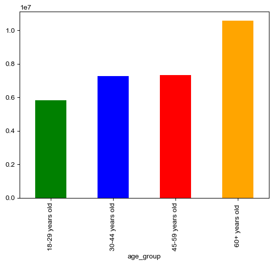

# Customer Purchase Analysis - Instacart Grocery Basket Analysis

## Project Overview:
Instacart, a thriving online grocery store, seeks enhanced sales insights through data and exploratory analysis. Focusing on customer variety and purchasing behaviors, the goal is to tailor marketing strategies for better market segmentation and targetting. Key questions revolved around identifying peak order times, understanding high-spending periods, simplifying price ranges, and pinpointing popular product departments. The analysis delves into customer classifications based on brand loyalty, regional differences, age, family status, and demographics. The outcome aims to guide targeted marketing campaigns, optimizing Instacart's approach to reach the right customers with the most relevant products.

## Tools & Skills:
### Python
### Packages: pandas, NumPy, Matplotlib, Seaborn
+ Conducted data wrangling and merging procedures.
+ Generated new variables using if- and for-loops.
+ Employed grouping and aggregation methods to structure and condense data.
+ Developed visualizations to improve the representation and comprehension of data.

## Data Cleaning & Transformation:
The final report outlines a detailed procedural sequence of all the cleaning and transformation steps. Key steps include:
+ Dropped "eval_set" column because it wasn't relevant to the analysis.
+ Renamed 5 columns for clarity and uniformity.
+ Created a 'loyalty_flag' variable to show returning users.
+ Developed 'region' variable based on the 5 US regions to determine if geographic location affects spending habits.
+ Created 'age_group' variable to determine if age affects spending habits.
+ Developed 'income_group' variable to determine if income level affects spending habits.
+ Created 'dependants_group' variable to determine if number of dependants was a factor in spending habits.
+ Developed 'family_status' variable from 'marital_status' and 'number_of_dependants' columns to cors reference groups and to find Instacart's biggest and smallest user demographics.

## Visualizations:
All visualizations are shown and explained in detail on the final report. Some key visualizations are:

Distribution of customers by age, showing that most Instacart users are 60 years or older

## Recommendations & Findings:
+ The marketing team should target ads to increase weekday shopping and shopping during the early hours of the day, especially between midnight and 6 AM.
+ Instacart should taget the early morning hours for its ads as most orders usually happen later in the morning and early afternoon.
+ The marketing and sales teams should create 2 categories for prices, one being "$15 or less" and another being "Over $15"
+ The most frequently purchased items are essential foods (produce/dairy and eggs) and that trend does not seem to be affected by any demographic information. 
+ Instacart should promote non-essentail products because the data shows that users will always buy essential items regardless of any demographic or geographic factors.

## Learning Experience:
Mastering a new programming language, particularly Python, presented a considerable learning curve during this project. I conducted comprehensive research, troubleshooted independently, and sought guidance from my mentor to grasp Python's intricacies for effective analysis. Dedicating time to understand Matplotlib and Seaborn libraries empowered me to craft enhanced visualizations. Continuous practice improved my ability to write clean, well-documented Python scripts, create variables, and generate visualizations. Trial and error experimentation in Python not only honed my skills but also enhanced my problem solving skills, elevating the overall quality of my work.

## Data Source:
The Instacart Online Grocery Shopping Dataset 2017 [Data set]. Accessed from www.instacart.com/datasets/grocery-shopping-2017 via Kaggle. https://drive.google.com/file/d/1hweDzLp0OC-tlFoZm_PBvp2gfH_xeU0v/view?usp=sharing
